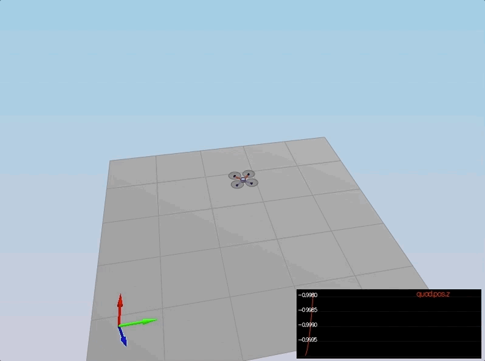
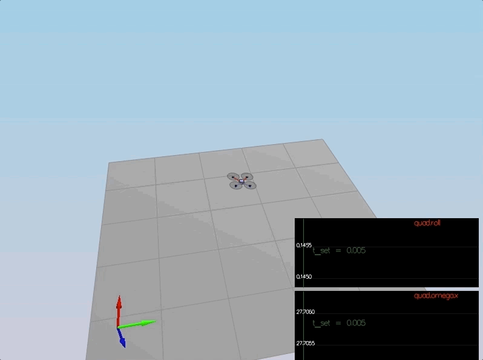
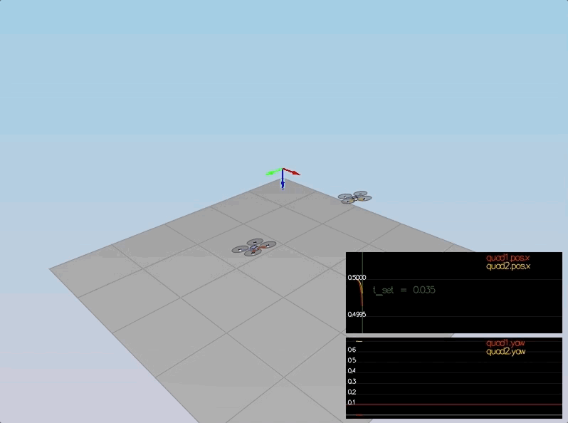
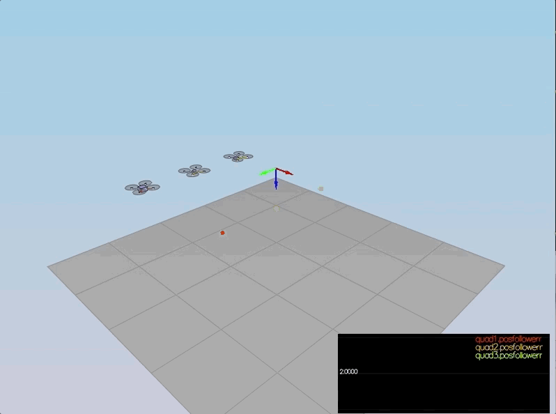

# FCND Project Submission #

This is the readme for the C++ control project for FCND course offered by Udacity. The file include all the rubric points and how they were addressed and specifically where in the code each step was handled.

## Implemented Controller ##

### Implemented body rate control. ###
A proportional controller on body rates was implemented. Intially I totally forgot to include the moment of inertia which resulted in wrong moment commands that was observed and corrected later.

```cpp
float p_error = pqrCmd.x - pqr.x;
momentCmd.x = kpPQR.x * p_error * Ixx;

float q_error = pqrCmd.y - pqr.y;
momentCmd.y = kpPQR.y * q_error * Iyy;

float r_error = pqrCmd.z - pqr.z;
momentCmd.z = kpPQR.z * r_error * Izz;
```


### Implement roll pitch control. ###
Following the same implementation provided in the python code, the controller uses the vehicle acceleration, thrust, and attitude to result in body rate commands. Drone's mass and attitude comands limits were accounted for when calculating the target angles.

```cpp
float c_d = collThrustCmd / mass;

if (collThrustCmd > 0.0){
    float target_R13 = - CONSTRAIN(accelCmd.x / c_d,-maxTiltAngle,maxTiltAngle);
    float target_R23 = - CONSTRAIN(accelCmd.y / c_d,-maxTiltAngle,maxTiltAngle);
    
    pqrCmd.x = (1 / R(2, 2)) * (-R(1, 0) * kpBank * (R(0, 2) - target_R13) + R(0, 0) * kpBank * (R(1, 2) -target_R23));
    
    pqrCmd.y = (1 / R(2, 2)) * (-R(1, 1) * kpBank * (R(0, 2) - target_R13) + R(0, 1) * kpBank * (R(1, 2) -target_R23));
}
pqrCmd.z = 0.0;
```


### Implement altitude controller. ###
Using the down position and the down velocity, thrust commands were produced. Adding the integrator later on made it possible to to handle the weight non-idealities presented in scenario 4.

```cpp
integratedAltitudeError += (posZCmd - posZ) * dt;

float velocity_cmd = CONSTRAIN(kpPosZ * (posZCmd - posZ) + velZCmd,-maxAscentRate,maxDescentRate);

float acceleration_cmd = kpVelZ * (velocity_cmd - velZ) + accelZCmd + KiPosZ * integratedAltitudeError;

acceleration_cmd -= CONST_GRAVITY;

thrust = - acceleration_cmd * mass / R(2, 2);
```

### Implement lateral position control. ###
Both the velocity and position were used to command local acceleration using a PD controller. Vehicle limits where incorporated into the produced commands.

```cpp
V3F velocity_cmd = kpPosXY * (posCmd - pos) + velCmd;

velocity_cmd.x = CONSTRAIN(velocity_cmd.x, -maxSpeedXY, maxSpeedXY);
velocity_cmd.y = CONSTRAIN(velocity_cmd.y, -maxSpeedXY, maxSpeedXY);
velocity_cmd.z = 0.0;

accelCmd = kpVelXY * (velocity_cmd - vel) + accelCmdFF;

accelCmd.x = CONSTRAIN(accelCmd.x, -maxAccelXY, maxAccelXY);
accelCmd.y = CONSTRAIN(accelCmd.y, -maxAccelXY, maxAccelXY);
accelCmd.z = 0.0;
```


### Implement yaw control. ###
A P controller were used to cmmand the yaw rate. A false comment in the documentation of the project on the functionality of fmod resulted in some confusion that was clarified after refuring to the slack community.

```cpp
yawCmd = fmod(yawCmd,F_PI);
yawRateCmd = kpYaw * fmod(yawCmd-yaw,F_PI);
```

### Calculate the motor commands given commanded thrust and moments.###

The thrust and moments were converted to the appropriate to the desired thrust forces for the moments. The dimensions of the drone ws accounted for when calculating thrust from moments. This was the most confusing bit of the project, however, a nice documentation from one of the students clarified everything!

```cpp
float l = L / sqrt(2);
float c_bar = collThrustCmd;
float p_bar = momentCmd.x / l;
float q_bar = momentCmd.y / l;
float r_bar = momentCmd.z / kappa;

float omega_1 = (c_bar + p_bar + q_bar - r_bar) / 4.0f;
float omega_2 = (c_bar - p_bar + q_bar + r_bar) / 4.0f;
float omega_3 = (c_bar + p_bar - q_bar + r_bar) / 4.0f;
float omega_4 = (c_bar - p_bar - q_bar - r_bar) / 4.0f;

cmd.desiredThrustsN[0] = CONSTRAIN(omega_1, minMotorThrust, maxMotorThrust);// front left
cmd.desiredThrustsN[1] = CONSTRAIN(omega_2, minMotorThrust, maxMotorThrust);// front right
cmd.desiredThrustsN[2] = CONSTRAIN(omega_3, minMotorThrust, maxMotorThrust);// rear left
cmd.desiredThrustsN[3] = CONSTRAIN(omega_4, minMotorThrust, maxMotorThrust);// rear right
```

## Flight Evaluation ##
The drone looks stable and performs the required task in all scenarios and can handle the non-linearities of some scenarios. For an initial tuning of kpPosXY, KpPosZ, KpVelXY, KpVelZ I followed an exhaustive search approach using a python code I wrote that can be found below:
```py
import fileinput
import time

rate = 0.1

kpPosXY_min = 2.9
kpPosXY_max = 3.9

kpPosZ_min = 2.6
kpPosZ_max = 3.9

def drange(start, stop, step):
    while start < stop:
            yield start
            start += step

# (1)
for kpPosXY in drange(kpPosXY_min,kpPosXY_max,rate):
	kpVelXY = 3.9*kpPosXY

	for line in fileinput.input("./config/QuadControlParams.txt", inplace=True):
		if line.strip().startswith('kpPosXY = '):
			line = 'kpPosXY = %s\n' % str(kpPosXY)
		elif line.strip().startswith('kpVelXY = '):
			line = 'kpVelXY = %s\n' % str(kpVelXY)
		print line,

	# (2)
	for kpPosZ in drange(kpPosZ_min,kpPosZ_max,rate):
		kpVelZ = 3.9*kpPosZ

		for line in fileinput.input("./config/QuadControlParams.txt", inplace=True):
			if line.strip().startswith('kpPosZ = '):
				line = 'kpPosZ = %s\n' % str(kpPosZ)
			elif line.strip().startswith('kpVelZ = '):
				line = 'kpVelZ = %s\n' % str(kpVelZ)
			print line,

		print(kpPosXY)
		print(kpPosZ)
		print(kpVelXY)
		print(kpVelZ)
		time.sleep(2.5)
```

For tuning kpYaw and kpPQRz, a similar python code was used: 
```py
import fileinput
import time

rate = 0.4

def drange(start, stop, step):
    while start < stop:
            yield start
            start += step
# (1)
for kpYaw in drange(2,4,rate):
	for line in fileinput.input("./config/QuadControlParams.txt", inplace=True):
		if line.strip().startswith('kpYaw = '):
			line = 'kpYaw = %s\n' % str(kpYaw)
		print line,
	# (2)
	for kpPQRz in drange(10,20,4):
		for line in fileinput.input("./config/QuadControlParams.txt", inplace=True):
			if line.strip().startswith('kpPQR = '):
				line = 'kpPQR = 60, 50, %s\n' % str(kpPQRz)
			print line,
		print(kpYaw)
		print(kpPQRz)
		time.sleep(2.5)
```
Further manual tunings were done at each stage to achieve optimal results.

### Scenario 1: ###
<p align="center">

</p>

### Scenario 2: ###
<p align="center">

</p>

### Scenario 3: ###
<p align="center">

</p>

### Scenario 4: ###
<p align="center">

</p>

### Extra Challenge 1 - Scenario 5: ###

A new `FigureEightFF.txt` was generated with velocity terms using the following addition to the python script:

```py
vx = (x-px)/timestep;
vy = (y-py)/timestep;
vz = (z-pz)/timestep;
px = x;
py = y;
pz = z;
```

The new generated trajectory with velocity information (orange one) enabled the drone to track the path well, especially the z component, and thus the over all position error was lower compared to the drone following the trajectory without velocity term (the red one). 

<p align="center">

</p>

## Video Documentation ##
A short video of the drone in different scenarios can be found [here](../Video_FCND_Control.mov).

